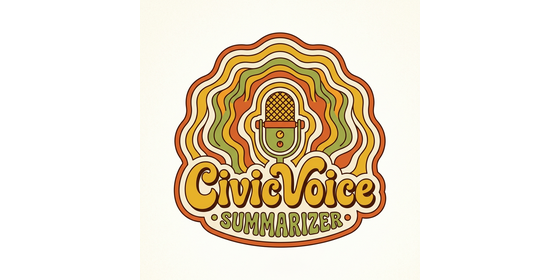
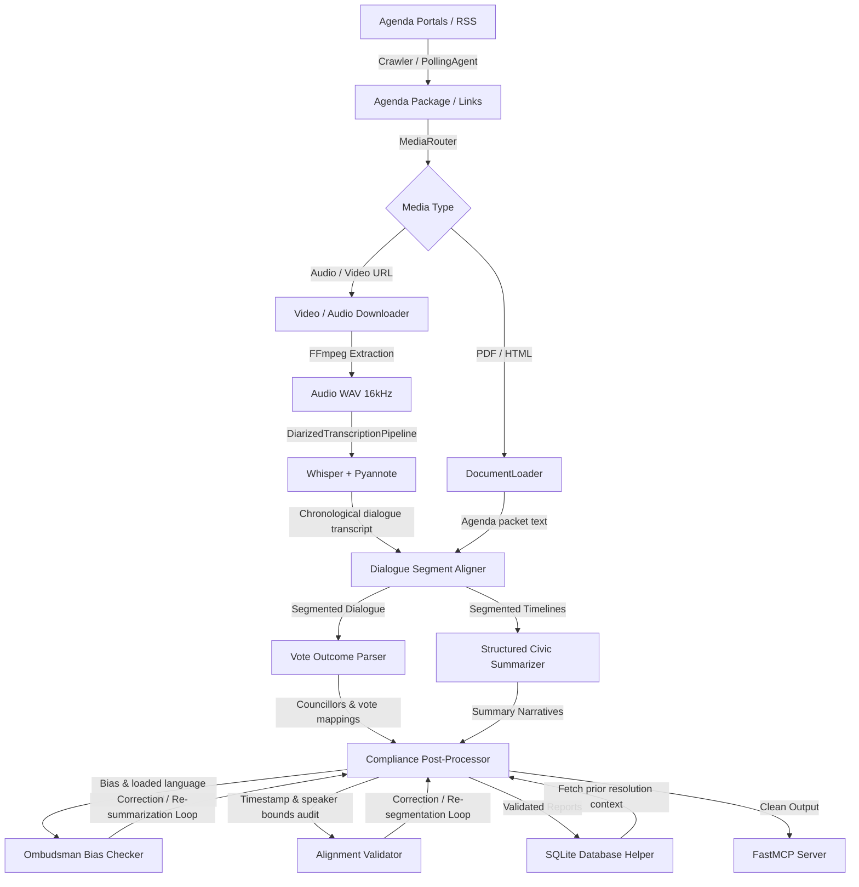

# Municipal Civic Engagement & Legislative Audit System

<p align="center">
  
</p>

An AI-driven agentic pipeline designed to monitor local government proceedings by crawling municipal agenda portals, downloading meeting media, transcribing and diarizing speakers, aligning dialogue timelines with official agendas, cross-referencing historical legislation, and auditing summaries for non-partisan neutrality and alignment accuracy.

---

## System Architecture

The diagram below outlines the flow of data through the ingestion, transcription, summarization, auditing, and storage layers:



---

## Directory and File Overview

### 1. Ingestion Layer ([ingestion/](file:///e:/Users/Dan/Documents/Antigravity/Kaggle_Capstone/ingestion))
Handles document polling, media downloading, and parsing formats:
*   [polling_agent.py](file:///e:/Users/Dan/Documents/Antigravity/Kaggle_Capstone/ingestion/polling_agent.py): Polls RSS feeds and scrapes CivicClerk portal sites (Greer, Greenville, Spartanburg) using raw standard libraries and preserves tracking states in `polling_state.json`.
*   [video_downloader.py](file:///e:/Users/Dan/Documents/Antigravity/Kaggle_Capstone/ingestion/video_downloader.py): Direct video downloader and native HLS `.m3u8` playlist parser that downloads and merges segments.
*   [audio_downloader.py](file:///e:/Users/Dan/Documents/Antigravity/Kaggle_Capstone/ingestion/audio_downloader.py): Audio downloader and FFmpeg wrapper to extract 16kHz mono audio channels from video files.
*   [pdf_extractor.py](file:///e:/Users/Dan/Documents/Antigravity/Kaggle_Capstone/ingestion/pdf_extractor.py): Extracts layout text and metadata fields from agenda PDFs using `pypdf`.
*   [summary_extractor.py](file:///e:/Users/Dan/Documents/Antigravity/Kaggle_Capstone/ingestion/summary_extractor.py): Custom HTML text parser using `HTMLParser` to strip script tags and stylesheet elements.
*   [media_router.py](file:///e:/Users/Dan/Documents/Antigravity/Kaggle_Capstone/ingestion/media_router.py): A routing controller that resolves target types (audio, video, PDF, HTML) and executes the proper ingestion process.
*   [document_loader.py](file:///e:/Users/Dan/Documents/Antigravity/Kaggle_Capstone/ingestion/document_loader.py): Standard loading mechanisms for converting physical text files into structured schemas.

### 2. Transcription Layer ([transcription/](file:///e:/Users/Dan/Documents/Antigravity/Kaggle_Capstone/transcription))
Orchestrates speaker diarization and audio transcriptions:
*   [audio_processor.py](file:///e:/Users/Dan/Documents/Antigravity/Kaggle_Capstone/transcription/audio_processor.py): Core data schemas (`DiarizedTranscript`, `DialogueLine`, `TranscriptionSegment`, `DiarizationSegment`).
*   [diarizer.py](file:///e:/Users/Dan/Documents/Antigravity/Kaggle_Capstone/transcription/diarizer.py): Integrates Pyannote speaker diarization, with a simulated offline fallback for local verification.
*   [pipeline.py](file:///e:/Users/Dan/Documents/Antigravity/Kaggle_Capstone/transcription/pipeline.py): Coordinates OpenAI Whisper transcription segments and Pyannote speaker turns, combining them via a maximum timestamp overlap algorithm into a chronological dialogue record (`[HH:MM:SS] Speaker: Dialogue`).

### 3. Summarization & Alignment ([summarization/](file:///e:/Users/Dan/Documents/Antigravity/Kaggle_Capstone/summarization))
Extracts structures and maps timeline segments to legislative agendas:
*   [summary_engine.py](file:///e:/Users/Dan/Documents/Antigravity/Kaggle_Capstone/summarization/summary_engine.py): Prompting engine that utilizes OpenAI structured output parsing to construct detailed [StructuredCivicSummary](file:///e:/Users/Dan/Documents/Antigravity/Kaggle_Capstone/summarization/summary_engine.py#L52) profiles (extracting debate points, councillor perspectives, and audience sentiment).
*   [agenda_aligner.py](file:///e:/Users/Dan/Documents/Antigravity/Kaggle_Capstone/summarization/agenda_aligner.py): Structured alignment of dialogue blocks to official council agendas.
*   [citizen_feedback.py](file:///e:/Users/Dan/Documents/Antigravity/Kaggle_Capstone/summarization/citizen_feedback.py): Keyword clustering and sentiment analysis for citizen feedback during public comment periods.

### 4. Auditing & Compliance ([auditor/](file:///e:/Users/Dan/Documents/Antigravity/Kaggle_Capstone/auditor))
Enforces factual accuracy, legal tracking, neutrality, and error recovery:
*   [legislative_database.py](file:///e:/Users/Dan/Documents/Antigravity/Kaggle_Capstone/auditor/legislative_database.py): SQLite helper to store and query historical resolutions, ordinances, and plans (matching `ORD-YYYY-XXX`, `RES-YYYY-XXX`, or `PLAN-YYYY-XXX` IDs).
*   [vote_parser.py](file:///e:/Users/Dan/Documents/Antigravity/Kaggle_Capstone/auditor/vote_parser.py): Maps individual voice votes, roll calls, and unanimous consent allocations to named councillors.
*   [bias_checker.py](file:///e:/Users/Dan/Documents/Antigravity/Kaggle_Capstone/auditor/bias_checker.py): Ombudsman checker auditing generated summaries for loaded language, partisan tone, or misattributions.
*   [alignment_validator.py](file:///e:/Users/Dan/Documents/Antigravity/Kaggle_Capstone/auditor/alignment_validator.py): Factual validator ensuring summary timestamps/speakers match raw diarized transcript data.
*   [post_processor.py](file:///e:/Users/Dan/Documents/Antigravity/Kaggle_Capstone/auditor/post_processor.py): Unified [PostProcessingPipeline](file:///e:/Users/Dan/Documents/Antigravity/Kaggle_Capstone/auditor/post_processor.py#L26) executing compliance checks in an **auto-correction loop**. If any segment is flagged with biased language or invalid timestamps, it automatically invokes LLM re-summarization or correction queries before producing final reports.
*   [compliance_tracker.py](file:///e:/Users/Dan/Documents/Antigravity/Kaggle_Capstone/auditor/compliance_tracker.py): Standard compliance tracker logging regulatory modifications.

### 5. Model Context Protocol Server ([mcp_server/](file:///e:/Users/Dan/Documents/Antigravity/Kaggle_Capstone/mcp_server))
*   [server.py](file:///e:/Users/Dan/Documents/Antigravity/Kaggle_Capstone/mcp_server/server.py): FastMCP server exposing tools to list, index, and query meetings. Directs standard output streams to `stderr` to prevent JSON-RPC pollution.

---

## Setup & Execution

### 1. Virtual Environment Setup
Ensure your terminal is in the project directory, then run:
```powershell
# Create virtual environment
python -m venv .venv

# Activate environment
.\.venv\Scripts\Activate.ps1

# Install required dependencies
pip install -r requirements.txt
```

### 2. Pre-Populate Legislative Database
Run the seeding script to initialize the SQLite database file with historical resolutions and ordinances:
```powershell
python scripts/seed_database.py
```

### 3. Run Automated Unit Tests
Execute the entire test suite covering mocking, database transactions, parsing heuristics, and auto-correction loops:
```powershell
.\.venv\Scripts\pytest
```

### 4. Execute End-to-End Greenville Demonstration
Run the integration script demonstrating diarization, transcript alignment, vote parsing, historical database lookup, and post-processing bias correction:
```powershell
python scripts/run_greenville_pipeline.py
```

### 5. MCP Server Registration
To register this indexer as an active MCP server in the platform configuration, add the following block to your [mcp_config.json](file:///C:/Users/Dan/.gemini/antigravity-ide/mcp_config.json):
```json
{
  "mcpServers": {
    "municipal-agenda-indexer": {
      "command": "e:\\Users\\Dan\\Documents\\Antigravity\\Kaggle_Capstone\\.venv\\Scripts\\python.exe",
      "args": [
        "e:\\Users\\Dan\\Documents\\Antigravity\\Kaggle_Capstone\\mcp_server\\server.py"
      ],
      "env": {}
    }
  }
}
```
